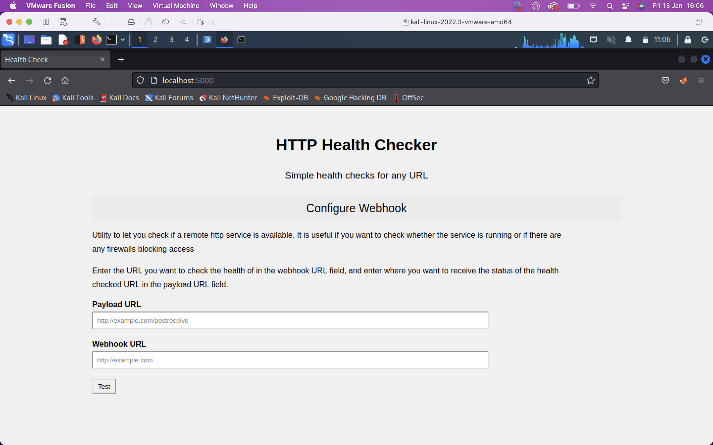

The site offers the functionality to check the health of an endpoint specified by a URL. It makes a request to the endpoint (labelled `webhookURL`) and formats a payload containing information about the health of the endpoint and posts it to the `payloadURL`. A simple netcat listener at the host and port specified in the payloadURL suffices. 

Even though the server enforces strict checks on the `webhookURL`, the site is still vulnerable to SSRF. Can you figure out hiw

    
Hint

Check out 'payloadallthethings' SSRF. You can get the server to make a request out to you, can you control where the server goes next?

# 

