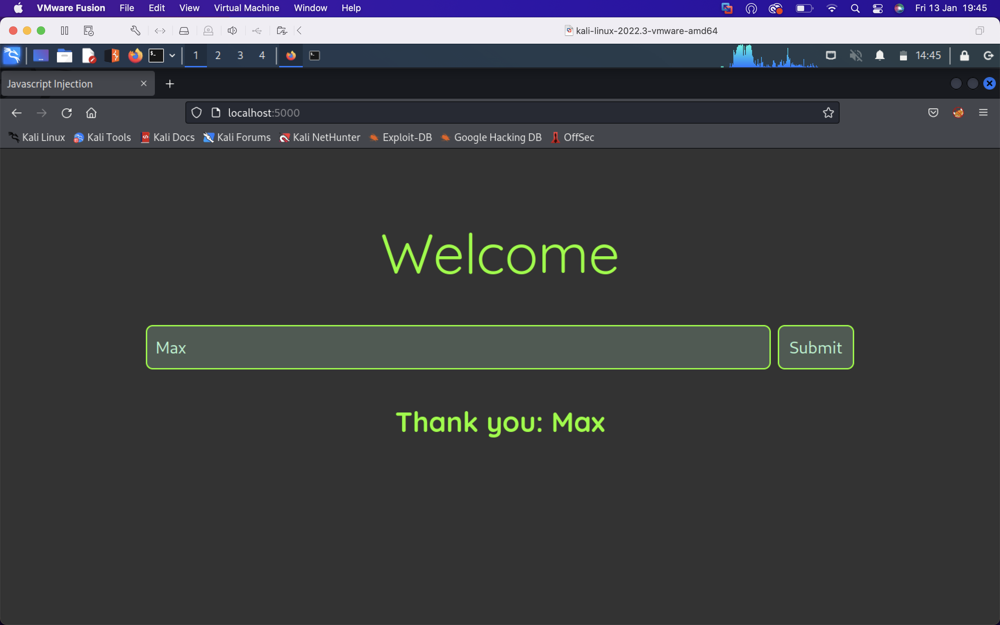
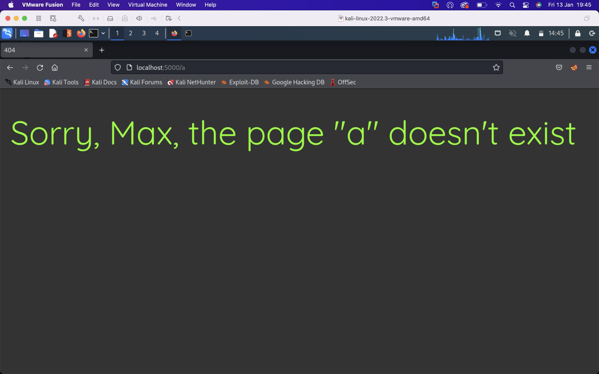

# Index Page


# 404 Page


This web app is vulnerable to SSTI as user input is directly concatenated into a string which is subsequently rendered. This gives the user the opportunity to inject arbitrary javascript which will be executed on the server.

The vulnerable code is

```
let html = ejs.render('<body><h1 class="fourohfour">Sorry, <%= name %>, the page "' + path + '" doesn\'t exist</h1></body></html>', { name : name })
```
since the path is stripped of the leading, `/`, the attacker can visit an arbitrary non-existent url and it will be injected directly into the template string.

The app is secured by rendering an `.ejs` file, <strong>then</strong> passing the user conntrolled input as a parameter, e.g. 
```
res.render('404.ejs', { name: name, path: path })
```
