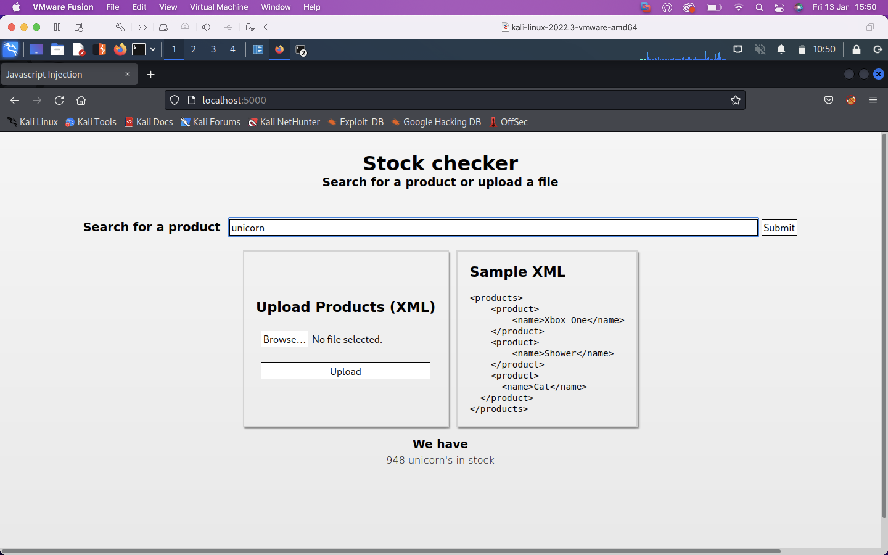
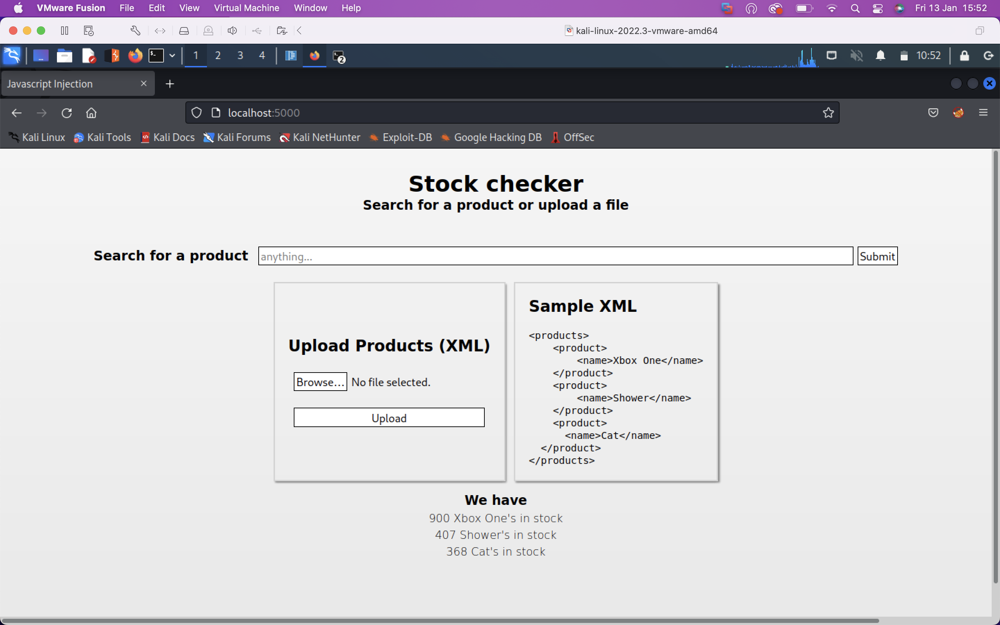

This web app has two vulnerabilities. Insecure deserialization will allow remote command execution (RCE), and XXE will allow local file inclusion (LFI).

Can you figure them out?

Hint, payloadallthethings XXE and node-serialize.

